# FGN Savings Bond Subscription Application

[](https://github.com/ajakaiye33/fgn-bonds/actions/workflows/ci.yml)

A modern web application for submitting Federal Government of Nigeria (FGN) Savings Bond applications. Built with React + FastAPI, featuring a 7-step form wizard, PDF generation, payment tracking, and DMO reporting.

## Table of Contents

- [Quick Start](#quick-start)
- [Screenshots](#screenshots)
- [Tech Stack](#tech-stack)
- [Architecture](#architecture)
- [Features Detail](#features-detail)
- [API Endpoints](#api-endpoints)
- [Configuration](#configuration)
- [Project Structure](#project-structure)
- [Makefile Commands](#makefile-commands)
- [Testing](#testing)
- [Docker Architecture](#docker-architecture)
- [Troubleshooting](#troubleshooting)
- [Production Deployment](#production-deployment)

---

## Quick Start

**Choose your path:**

| Goal | Method | Time |
|------|--------|------|
| **Just run the app** | [Docker](#docker-deployment) | ~2 min |
| **Develop locally** | [Local Development](#local-development) | ~5 min |
| **Run tests** | [Testing](#testing) | ~1 min |

### Docker Deployment

**Prerequisites:** Docker Engine 20.10+, Docker Compose 2.0+, Port 80 available

```bash
# 1. Clone and configure
git clone <repository-url>
cd fgnbond_sub
cp backend/.env.example backend/.env

# 2. Start all services
docker-compose up -d

# 3. Verify deployment
docker-compose ps
```

**Access the app:**

| Service | URL |
|---------|-----|
| User Form | http://localhost |
| Admin Dashboard | http://localhost/admin |
| API Docs | http://localhost/api/docs |

> **Default Admin:** `admin` / `admin123` — Change before production!

### Local Development

**Prerequisites:** Python 3.12+, Node.js 20+, npm 10+

**Backend:**
```bash
cd backend
python3.12 -m venv venv
source venv/bin/activate  # Windows: venv\Scripts\activate
pip install -r requirements.txt
cp .env.example .env
uvicorn app.main:app --reload --port 8000
```

**Frontend** (new terminal):
```bash
cd frontend
npm install
npm run dev
```

**Access the app:**

| Service | URL |
|---------|-----|
| Frontend | http://localhost:5173 |
| Backend API | http://localhost:8000 |
| API Docs | http://localhost:8000/docs |

> **Tip:** Use `make dev` to start both backend and frontend simultaneously.

---

## Key Features

- **7-Step Subscription Wizard** - Guided form for Individual, Joint, and Corporate applicants
- **PDF Generation** - Official DMO form layout with instant download
- **Payment Tracking** - Record, verify, and manage subscriber payments
- **DMO Reports** - Generate monthly reports for Debt Management Office submission
- **Admin Dashboard** - Analytics, filtering, and export capabilities

---

## Screenshots

### User Subscription Form

#### Step 1: Bond Details
Select bond tenor (2-Year or 3-Year), month of offer, and subscription amount with automatic conversion to words.

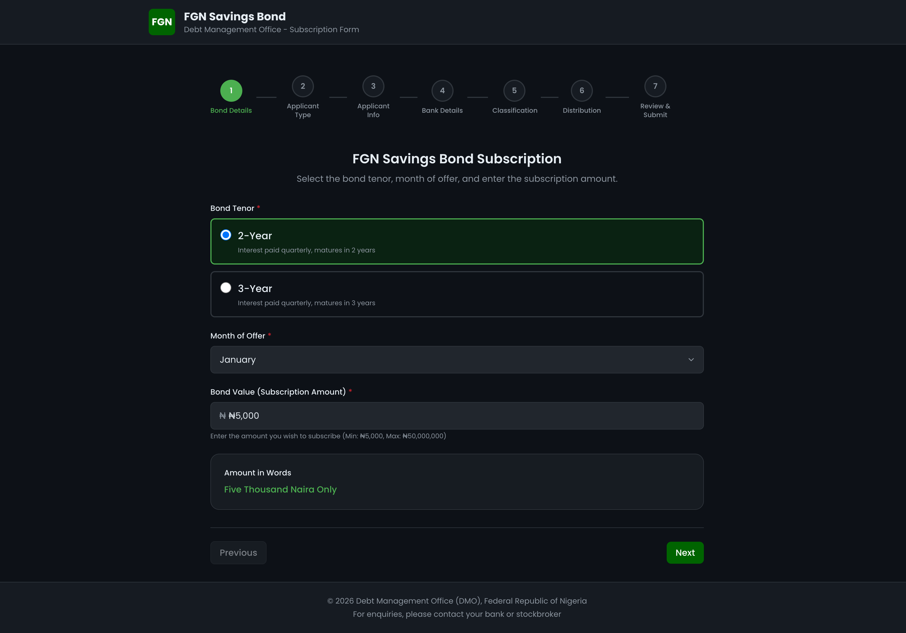

#### Step 2: Applicant Type
Choose between Individual, Joint, or Corporate subscription types.

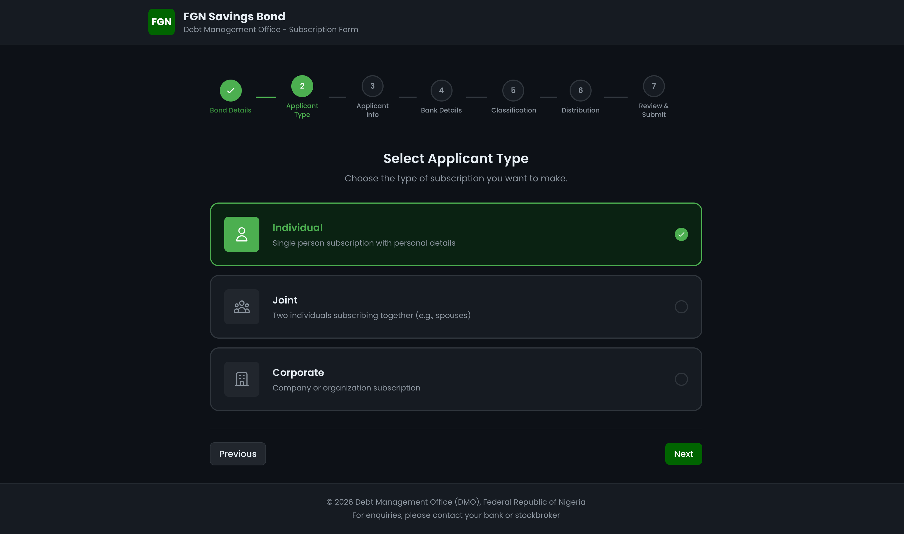

#### Step 3: Applicant Information
Enter personal details including name, contact information, and identification numbers.

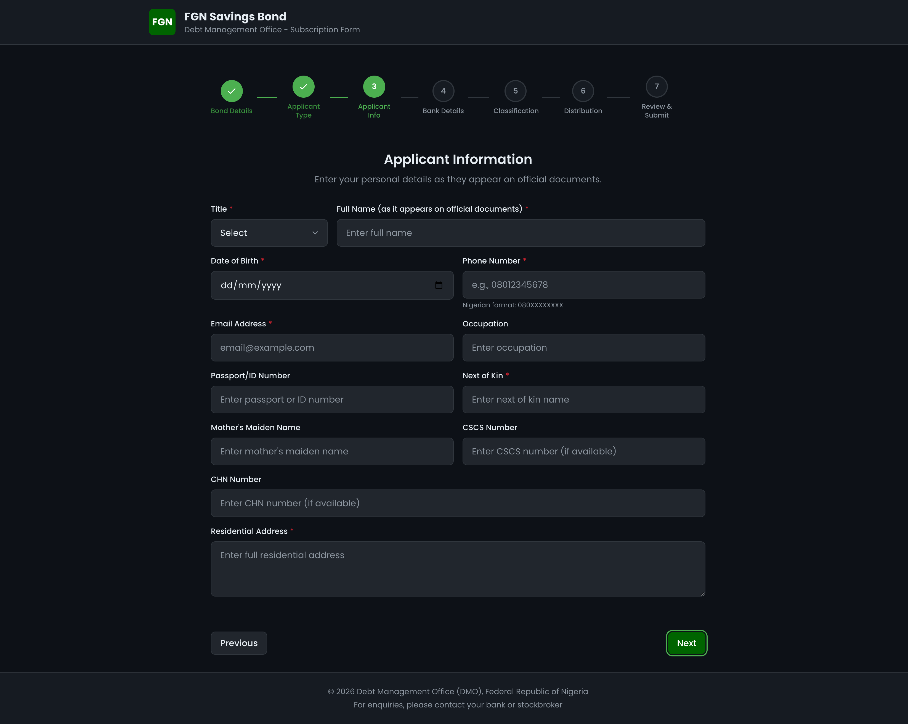

#### Step 4: Bank Details
Provide bank account details for interest payments and principal at maturity.

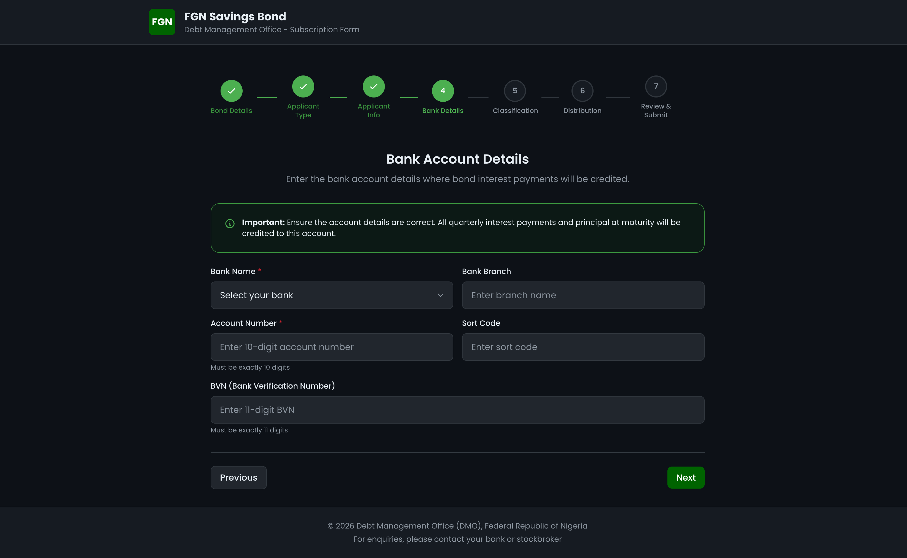

#### Step 5: Investor Classification
Indicate residency status and select applicable investor categories.

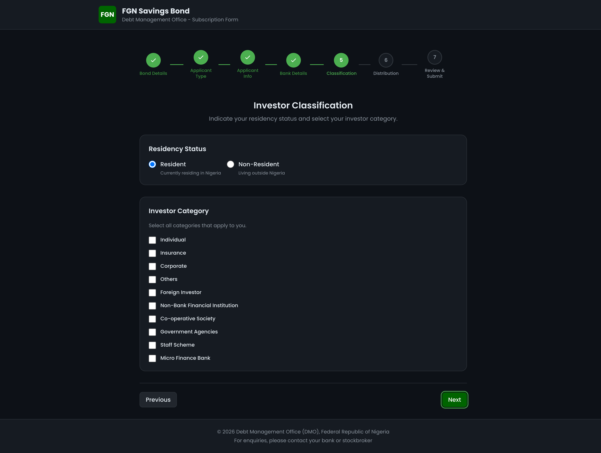

#### Step 6: Distribution Agent
Optional stockbroker/agent information and witness details.

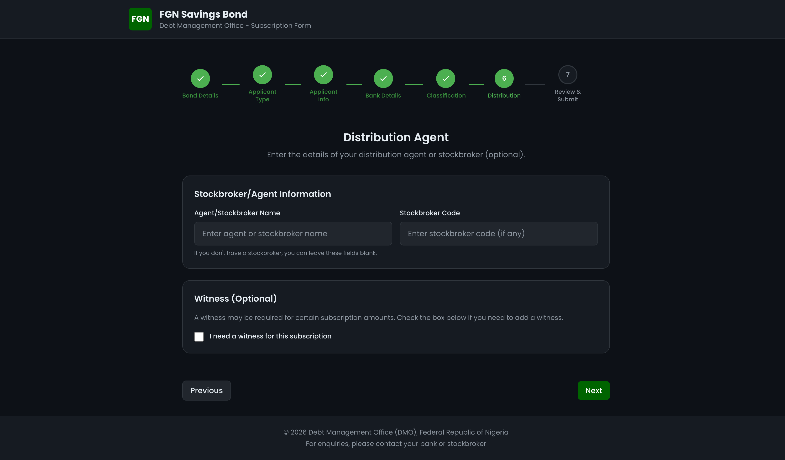

#### Step 7: Review & Submit
Review all information and accept the declaration before submission.

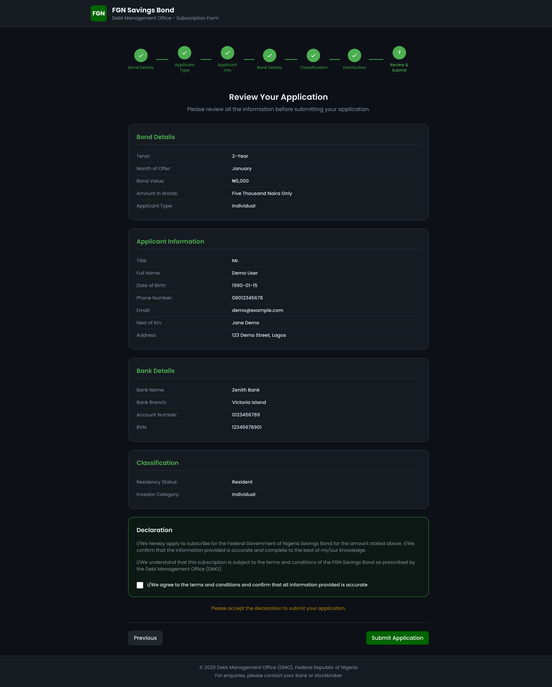

#### Success & PDF Download
After submission, download the official PDF application form.


---

### Admin Dashboard

#### Admin Login
Secure JWT-authenticated access to the admin dashboard.

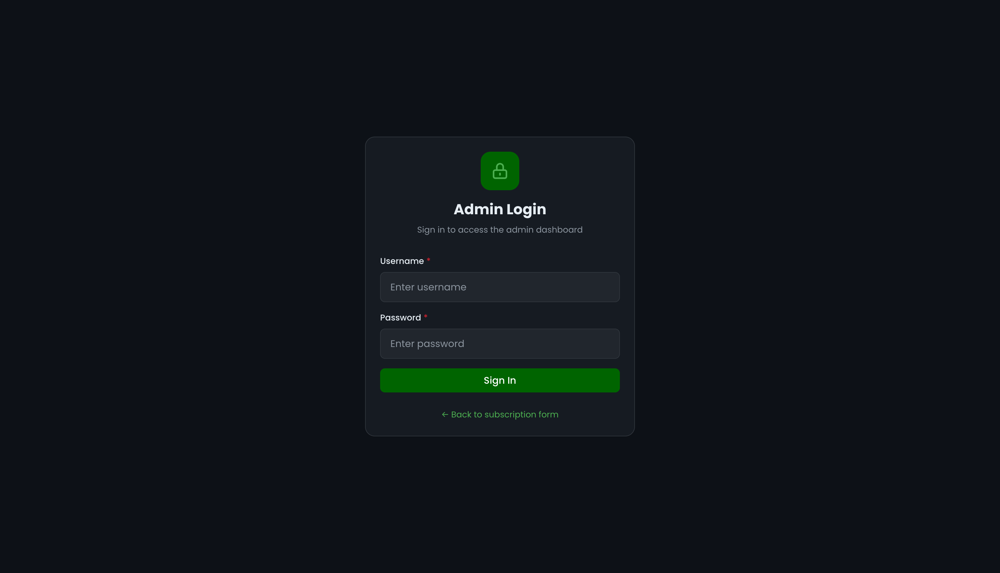

#### Overview Tab
Dashboard metrics with charts showing applications by type, tenor, and monthly trends.

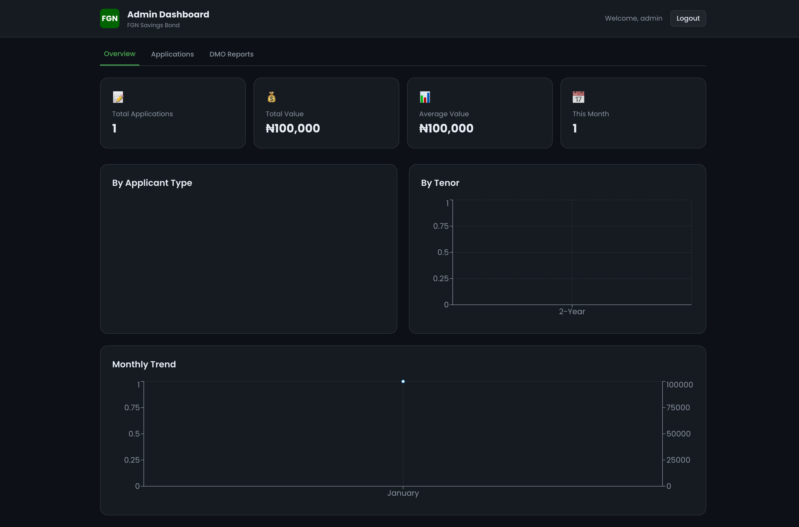

#### Applications Tab
List all applications with advanced filtering by date, value, tenor, and **payment status**.

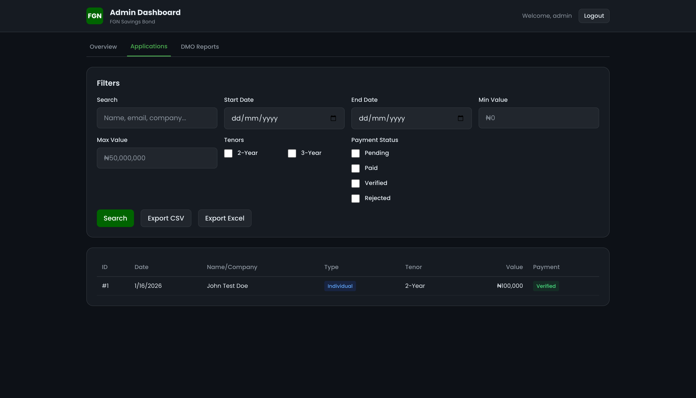

#### Payment Tracking
View application details and manage payments with verification workflow.

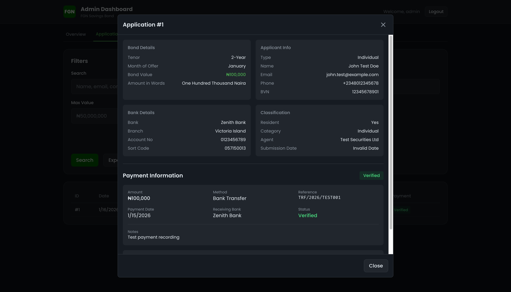

**Payment Features:**
- Record payment with amount, method, reference, and date
- Upload payment evidence documents (PDF, JPG, PNG)
- Verify or reject payments with notes
- Track payment status: Pending → Paid → Verified/Rejected

#### DMO Reports Tab
Generate monthly reports for submission to the Debt Management Office.

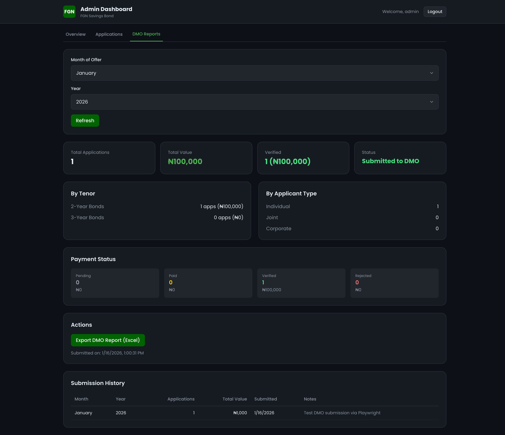

**DMO Report Features:**
- Summary by month/year with total applications and value
- Breakdown by tenor (2-Year/3-Year) and applicant type
- Payment status overview (Pending, Paid, Verified, Rejected)
- Export to Excel with detailed subscriber list
- Track submission history

---

## Tech Stack

| Layer | Technology |
|-------|------------|
| **Frontend** | React 19, TypeScript, Tailwind CSS, React Hook Form, Zod, Recharts |
| **Backend** | FastAPI, Pydantic, SQLAlchemy, SQLite |
| **PDF Generation** | ReportLab (official DMO form layout) |
| **Authentication** | JWT with bcrypt password hashing |
| **Testing** | Vitest + Testing Library (frontend), Pytest (backend) |
| **Deployment** | Docker (multi-stage), Nginx reverse proxy |

---

## Architecture

```
┌─────────────────────────────────────────────────────────────┐
│                         NGINX                                │
│                    (Port 80 - Reverse Proxy)                │
└─────────────────────────────────────────────────────────────┘
                              │
          ┌───────────────────┼───────────────────┐
          │                   │                   │
          ▼                   ▼                   │
┌─────────────────┐  ┌─────────────────┐         │
│    Frontend     │  │     Backend     │         │
│   (React SPA)   │  │    (FastAPI)    │         │
│                 │  │                 │         │
│  - Form Wizard  │  │  - REST API     │         │
│  - Admin UI     │  │  - PDF Gen      │         │
│  - Charts       │  │  - Auth (JWT)   │         │
└─────────────────┘  └────────┬────────┘         │
                              │                   │
                              ▼                   │
                    ┌─────────────────┐          │
                    │     SQLite      │◄─────────┘
                    │   (Database)    │
                    └─────────────────┘
```

---

## Features Detail

### User Form (7-Step Wizard)

| Step | Purpose |
|------|---------|
| 1 | Bond Details - Tenor, month, subscription amount (₦5,000 - ₦50,000,000) |
| 2 | Applicant Type - Individual, Joint, or Corporate |
| 3 | Applicant Info - Personal/company details, contact, IDs |
| 4 | Bank Details - Account for interest payments, BVN validation |
| 5 | Classification - Residency status, investor category |
| 6 | Distribution - Agent/stockbroker details, witness (optional) |
| 7 | Review & Submit - Declaration and PDF download |

### Admin Dashboard

| Feature | Description |
|---------|-------------|
| **Metrics** | Total applications, value, averages, monthly counts |
| **Charts** | By applicant type, tenor, monthly trends |
| **Filters** | Date range, value range, search, tenor, payment status |
| **Exports** | CSV and Excel with summary sheets |
| **Payments** | Record, verify, reject with evidence uploads |
| **DMO Reports** | Monthly summaries, Excel export, submission tracking |

### Payment Workflow

```
Application Submitted
         │
         ▼
    ┌─────────┐
    │ Pending │ ← No payment recorded
    └────┬────┘
         │ Record Payment
         ▼
    ┌─────────┐
    │  Paid   │ ← Payment recorded, awaiting verification
    └────┬────┘
         │
    ┌────┴────┐
    │         │
    ▼         ▼
┌────────┐ ┌──────────┐
│Verified│ │ Rejected │
└────────┘ └──────────┘
```

### PDF Generation
- Official DMO form layout with green color scheme
- All applicant types supported (Individual, Joint, Corporate)
- Signature and witness sections
- Instant download after submission

---

## API Endpoints

### Public

| Method | Endpoint | Description |
|--------|----------|-------------|
| GET | `/api/health` | Health check |
| GET | `/api/constants` | Form constants (banks, categories) |
| POST | `/api/applications` | Submit application |
| GET | `/api/applications/{id}` | Get application details |
| GET | `/api/applications/{id}/pdf` | Download PDF |

### Admin (JWT Protected)

| Method | Endpoint | Description |
|--------|----------|-------------|
| POST | `/api/auth/login` | Admin login |
| GET | `/api/auth/me` | Current user info |
| GET | `/api/admin/applications` | List with filters |
| GET | `/api/admin/summary` | Dashboard metrics |
| GET | `/api/admin/analytics` | Chart data |
| GET | `/api/admin/export/csv` | Export to CSV |
| GET | `/api/admin/export/excel` | Export to Excel |

### Payment Management

| Method | Endpoint | Description |
|--------|----------|-------------|
| POST | `/api/admin/applications/{id}/payment` | Record payment |
| GET | `/api/admin/applications/{id}/payment` | Get payment details |
| PATCH | `/api/admin/payments/{id}` | Update payment |
| POST | `/api/admin/payments/{id}/verify` | Verify/reject payment |
| DELETE | `/api/admin/payments/{id}` | Delete payment |

### Document Management

| Method | Endpoint | Description |
|--------|----------|-------------|
| POST | `/api/admin/payments/{id}/documents` | Upload evidence |
| GET | `/api/admin/payments/{id}/documents` | List documents |
| GET | `/api/admin/documents/{id}/download` | Download document |
| DELETE | `/api/admin/documents/{id}` | Delete document |

### DMO Reports

| Method | Endpoint | Description |
|--------|----------|-------------|
| GET | `/api/admin/reports/monthly-summary` | Get monthly summary |
| GET | `/api/admin/reports/export/excel` | Export DMO report |
| POST | `/api/admin/reports/submit-to-dmo` | Mark as submitted |
| GET | `/api/admin/reports/submissions` | Submission history |

---

## Configuration

### Environment Variables (backend/.env)

| Variable | Description | Default |
|----------|-------------|---------|
| `DATABASE_URL` | SQLite connection string | `sqlite:///./data/fgn_bonds.db` |
| `ADMIN_USERNAME` | Admin login username | `admin` |
| `ADMIN_PASSWORD_HASH` | bcrypt hash of password | Hash of `admin123` |
| `JWT_SECRET_KEY` | Secret for JWT tokens | (generate unique) |
| `CORS_ORIGINS` | Allowed frontend origins | `["http://localhost:3000"]` |

### Generating Admin Password Hash

```bash
python -c "import bcrypt; print(bcrypt.hashpw('YourPassword'.encode(), bcrypt.gensalt()).decode())"
```

---

## Project Structure

```
fgnbond_sub/
├── backend/
│   ├── app/
│   │   ├── main.py              # FastAPI entry point
│   │   ├── config.py            # Settings & environment
│   │   ├── database.py          # SQLAlchemy setup
│   │   ├── models/              # Database models
│   │   │   ├── application.py   # Application model
│   │   │   └── payment.py       # Payment, Document, DMOSubmission
│   │   ├── schemas/             # Pydantic schemas
│   │   ├── routers/             # API endpoints
│   │   │   ├── applications.py  # Public endpoints
│   │   │   ├── admin.py         # Admin + Payment + Reports
│   │   │   └── auth.py          # Authentication
│   │   └── services/            # Business logic
│   ├── pdf/                     # PDF generation (ReportLab)
│   ├── uploads/                 # Payment evidence documents
│   ├── data/                    # SQLite database
│   ├── requirements.txt
│   └── Dockerfile
│
├── frontend/
│   ├── src/
│   │   ├── components/
│   │   │   ├── wizard/          # Form step components
│   │   │   ├── admin/           # Admin dashboard components
│   │   │   │   ├── ApplicationDetailModal.tsx
│   │   │   │   └── DocumentUpload.tsx
│   │   │   └── ui/              # Reusable UI components
│   │   ├── pages/
│   │   │   ├── SubscriptionForm.tsx
│   │   │   ├── AdminDashboard.tsx  # Overview, Applications, DMO Reports
│   │   │   └── AdminLogin.tsx
│   │   ├── services/api.ts      # API client
│   │   ├── lib/                 # Utils, constants, validation
│   │   └── types/               # TypeScript types
│   ├── package.json
│   └── Dockerfile
│
├── nginx/nginx.conf             # Reverse proxy config
├── docker-compose.yml           # Docker orchestration
├── docs/screenshots/            # Application screenshots
└── README.md
```

---

## Makefile Commands

```bash
# Quick Start
make help          # Show all commands
make setup         # First-time setup
make up            # Start Docker services
make down          # Stop services
make dev           # Start local development

# Testing
make test                    # Run all tests (local)
make test-docker             # Run all tests (Docker)
make test-docker-backend     # Run backend tests (Docker)
make test-docker-frontend    # Run frontend tests (Docker)
make test-coverage           # Run tests with coverage

# Code Quality
make lint          # Run linting checks
make lint-fix      # Auto-fix linting issues

# Docker
make build         # Build Docker images
make rebuild       # Rebuild without cache
make logs          # View logs
make clean         # Remove containers and volumes
```

---

## Testing

The project includes comprehensive test suites for both frontend and backend.

### Test Summary

| Component | Framework | Tests | Coverage |
|-----------|-----------|-------|----------|
| **Frontend** | Vitest + Testing Library | 67 | Utilities, validation, hooks |
| **Backend** | Pytest | 78 | Auth, API, schemas, payments |

### Running Tests Locally

```bash
# Frontend tests
cd frontend
npm run test:run          # Run once
npm run test              # Watch mode
npm run test:coverage     # With coverage

# Backend tests
cd backend
pytest tests/ -v                              # Run all tests
pytest tests/ -v --cov=app --cov-report=html  # With coverage report
```

### Running Tests via Docker

```bash
# Frontend tests
docker-compose --profile test run --rm frontend-test

# Backend tests
docker-compose run --rm backend pytest tests/ -v

# Run with specific test file
docker-compose run --rm backend pytest tests/test_auth.py -v
```

### CI/CD Pipeline

Tests run automatically on GitHub Actions for:
- Push to `main` or `develop` branches
- Pull requests to `main`

The pipeline includes:
1. **Backend**: Linting (flake8, black, isort), tests with coverage
2. **Frontend**: Linting (ESLint), type checking, tests, build
3. **Docker**: Compose validation, build, health check

---

## Docker Architecture

The application uses **multi-stage Docker builds** for optimized images.

### Frontend Dockerfile Stages

```
┌─────────────────────────────────────────────────────────────┐
│                        deps                                  │
│              (node:20-alpine - npm ci)                       │
└─────────────────────────────────────────────────────────────┘
                              │
          ┌───────────────────┴───────────────────┐
          │                                       │
          ▼                                       ▼
┌─────────────────────┐               ┌─────────────────────┐
│        test         │               │       build         │
│  (Node.js + source) │               │  (Node.js + build)  │
│                     │               │                     │
│  npm run test:run   │               │   npm run build     │
│  npm run lint       │               │                     │
└─────────────────────┘               └──────────┬──────────┘
                                                 │
                                                 ▼
                                    ┌─────────────────────┐
                                    │     production      │
                                    │   (nginx:alpine)    │
                                    │                     │
                                    │   Static files only │
                                    │   ~25MB image       │
                                    └─────────────────────┘
```

### Building Specific Stages

```bash
# Production image (default)
docker build -t frontend ./frontend

# Test image (includes Node.js for running tests)
docker build --target test -t frontend-test ./frontend
```

### Docker Compose Services

| Service | Purpose | Profile |
|---------|---------|---------|
| `nginx` | Reverse proxy | default |
| `frontend` | Production React app | default |
| `backend` | FastAPI server | default |
| `frontend-test` | Run frontend tests | `test` |

---

## Troubleshooting

### Services Not Starting

```bash
docker-compose ps
docker-compose logs backend
docker-compose logs frontend
```

### Database Schema Issues

```bash
# Reset database (WARNING: deletes all data)
docker exec <backend-container> rm -f /app/data/fgn_bonds.db
docker restart <backend-container>
```

### Admin Login Not Working

1. Verify password hash in `backend/.env`
2. Check JWT_SECRET_KEY is set
3. Clear browser localStorage and try again

---

## Production Deployment

1. Update `backend/.env` with secure values:
   - Generate new `JWT_SECRET_KEY`
   - Set strong admin password
   - Configure `CORS_ORIGINS` for your domain

2. Build and deploy:
   ```bash
   docker-compose up -d --build
   ```

3. Configure SSL/TLS via nginx or reverse proxy

4. Set up database backups

---

## License

This project is licensed under the MIT License.

---

## Author

**Hedgar Ajakaiye**

---

## Acknowledgments

- Debt Management Office (DMO) of Nigeria
- Federal Government of Nigeria
